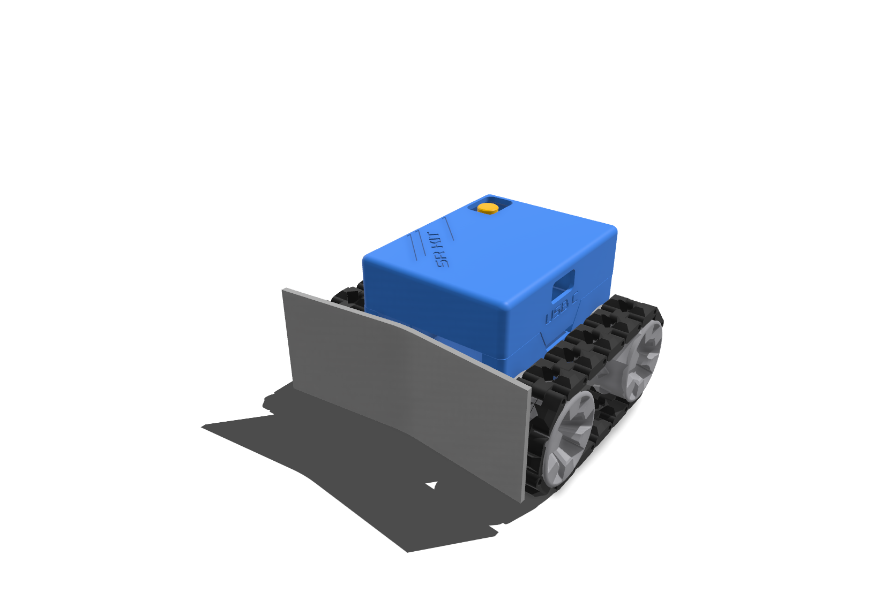

# SR-Kit



Kit de robótica basado en ESP32 que permite controlar un robot con dos motores DC (tracción diferencial) y un buzzer a través de Bluetooth clásico (SPP). Incluye el firmware, una app Android para el control y modelos 3D para imprimir accesorios.

## Contenido del repositorio

- `src/MandoBluetooth.ino` — Firmware para ESP32 (control de motores y buzzer vía Bluetooth).
- `apk/SR_app.apk` — Aplicación Android para enviar los comandos de control por Bluetooth.
- `models/Pala.stl` — Modelo 3D imprimible de una de las piezas del kit.

## Hardware

- Placa ESP32.
- Driver de motores DRV8833 (doble puente H).
- 2 motores DC.
- 1 buzzer.
- Fuente de alimentación para los motores.

### Conexión de pines

| Función | Pin ESP32 |
|---|---|
| Motor A - IN1 | 18 |
| Motor A - IN2 | 19 |
| Motor B - IN1 | 16 |
| Motor B - IN2 | 17 |
| Buzzer | 27 |
| DRV8833 EEP/SLEEP | 4 |

El pin `EEP` del DRV8833 se pone en `HIGH` al iniciar para sacar el driver del modo *sleep*.

## Firmware

El ESP32 se anuncia por Bluetooth con el nombre `SR_kit` (variable `device_name` en el `.ino`, se puede renombrar antes de compilar).

### Uso con varios dispositivos/robots

Si se van a programar varios kits (varias placas ESP32), es necesario cambiar el nombre Bluetooth en cada una antes de flashear, editando la variable `device_name` en `src/MandoBluetooth.ino`:

```cpp
String device_name = "SR_kit";
```

Si todos los robots mantienen el mismo nombre, el Bluetooth del celular (y la app) no podrá distinguir un dispositivo de otro: al emparejar o reconectar puede aparecer un solo dispositivo repetido o conectarse al robot equivocado, sobrescribiendo el emparejamiento anterior. Se recomienda usar un nombre único por robot (por ejemplo `SR_Kit_01`, `SR_Kit_02`, etc.) antes de subir el firmware a cada placa.

El control de velocidad de los motores se hace por PWM (`ledc`) a 5 kHz con resolución de 10 bits, usando 4 canales (2 por motor, uno por cada sentido de giro).

### Requisitos para compilar

- [Arduino IDE](https://www.arduino.cc/en/software) con soporte para ESP32 instalado (Boards Manager: `esp32` de Espressif).
- Habilitar Bluetooth clásico (SPP) al compilar; el propio `.ino` valida esto en tiempo de compilación y falla si `CONFIG_BT_ENABLED`, `CONFIG_BLUEDROID_ENABLED` o `CONFIG_BT_SPP_ENABLED` no están activos.

### Flasheo

1. Abrir `src/MandoBluetooth.ino` en el Arduino IDE.
2. Seleccionar la placa ESP32 correspondiente y el puerto serial.
3. Compilar y subir el firmware.
4. Abrir el Monitor Serial a 115200 baudios para verificar el mensaje de inicio.

## Protocolo de comandos (Bluetooth)

La app (o cualquier cliente Bluetooth SPP) se conecta al dispositivo `SR_kit` y envía un único carácter por comando:

| Comando | Acción |
|---|---|
| `1` | Adelante |
| `2` | Atrás |
| `3` | Derecha |
| `4` | Izquierda |
| `5` | Detener motores |
| `6` | Activar buzzer (500 ms) |

## App Android

En `apk/SR_app.apk` está la aplicación para emparejar el celular con el ESP32 por Bluetooth y enviar los comandos anteriores desde una interfaz táctil. Instalar habilitando "orígenes desconocidos" en Android.

## Modelo 3D

`models/Pala.stl` contiene el modelo de la pala del kit, listo para imprimir en 3D.
